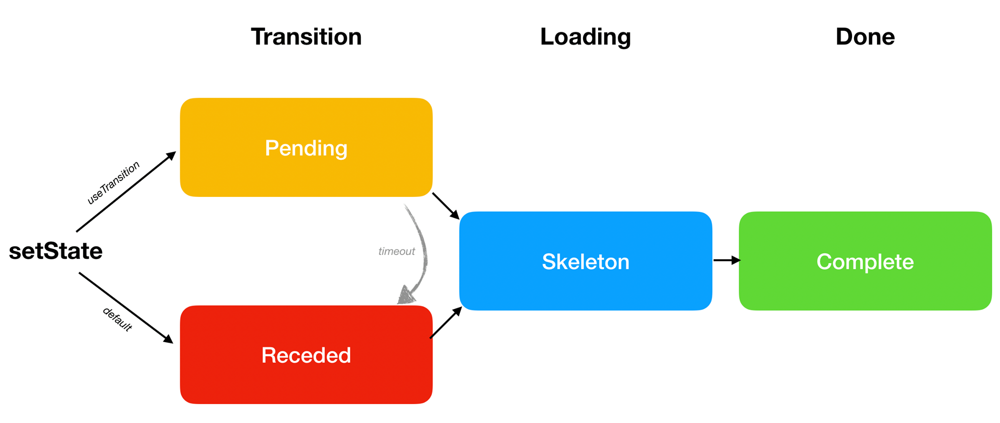

<style>
.scary > blockquote {
  background-color: rgba(237, 51, 21, 0.2);
  border-left-color: #ed3315;
}
</style>

<div class="scary">

>Perhatian:
>
>Laman ini menjelaskan **fitur eksperimental yang [belum tersedia](/docs/concurrent-mode-adoption.html) dalam versi rilis yang stabil**. Jangan mengandalkan _build_ eksperimental dalam aplikasi React versi produksi. Fitur ini dapat berubah secara signifikan dan tanpa peringatan sebelum menjadi bagian dari React.
>
>Dokumentasi ini ditujukan untuk pengguna awal dan orang-orang yang penasaran. **Kalau Anda baru menggunakan React, jangan khawatir tentang fitur ini** -- anda tidak perlu mempelajarinya sekarang.

</div>

Biasanya, ketika kita mengubah state, kita akan langsung melihat perubahannya di layar. Ini masuk akal karena kita ingin aplikasi responsif terhadap input user. Tetapi, mungkin ada kasus dimana kita lebih memilih untuk **menunda perubahan yang terjadi di layar**

Contohnya, ketika kita pindah laman, dan belum ada data yang tersedia untuk laman selanjutnya, mungkin kita akan merasa frustasi ketika melihat laman dengan loading. Kita mungkin lebih memilih untuk tetap berada di laman sebelumnya. Meng-implementasi pola ini secara historis sulit dalam React. Concurrent Mode menawarkan seperangkat alat baru untuk melakukan itu.
- [Transisi](#transitions)
  - [Setstate di Dalam Transisi](#wrapping-setstate-in-a-transition)
  - [Menambah Indikator Tunggu](#adding-a-pending-indicator)
  - [Me-review Perubahan](#reviewing-the-changes)
  - [Di Mana Perubahan Yerjadi?](#where-does-the-update-happen)
  - [Transisi di Setiap Tempat](#transitions-are-everywhere)
  - [Memadukan Transisi ke Dalam _Design System_](#baking-transitions-into-the-design-system)
- [Tiga Langkah](#the-three-steps)
  - [Default: Receded → Skeleton → Complete](#default-receded-skeleton-complete)
  - [Preferred: Pending → Skeleton → Complete](#preferred-pending-skeleton-complete)
  - [Wrap Lazy Features in `<Suspense>`](#wrap-lazy-features-in-suspense)
  - [Suspense Reveal “Train”](#suspense-reveal-train)
  - [Delaying a Pending Indicator](#delaying-a-pending-indicator)
  - [Recap](#recap)
- [Cara lain](#other-patterns)
  - [Memisahkan State dengan Prioritas Tinggi dan Rendah](#splitting-high-and-low-priority-state)
  - [Menangguhkan Sebuah Nilai](#deferring-a-value)
  - [SuspenseList](#suspenselist)
- [Selanjutnya](#next-steps)

## Transisi {#transitions}

Mari buka kembali [demo berikut](https://codesandbox.io/s/infallible-feather-xjtbu) dari the laman sebelumnya mengenai [Suspense for Data Fetching](/docs/concurrent-mode-suspense.html).

Ketika kita klik Tombol "Next" untuk mengubah profil aktif, data laman sebelumnya langsung menghilang, dan kita melihat indikator loading untuk seluruh laman lagi. Kita bisa menyebut hal ini loading state yang "tidak diinginkan". **Akan lebih baik jika kita bisa "melewatinya" dan menunggu konten tersebut selesai di load sebelum pindah ke laman baru**

React punya Hook khusus `useTransition()` untuk menangani masalah ini.

Kita bisa menggunakannya dengan 3 langkah.

Pertama, Kita harus menggunakan Concurrent Mode. Kita akan membahas lebih lanjut tentang [mengadopsi Concurrent Mode](/docs/concurrent-mode-adoption.html) lain waktu, untuk sekarang kita hanya perlu tahu kalau kita akan menggunakan `ReactDOM.createRoot()` daripada `ReactDOM.render()` agar fitur berikut dapat bekerja:

```js
const rootElement = document.getElementById("root");
// Opt into Concurrent Mode
ReactDOM.createRoot(rootElement).render(<App />);
```

Selanjutnya kita import hook`useTransition` dari React:

```js
import React, { useState, useTransition, Suspense } from "react";
```

Terakhir, kita pakai hook tersebut di dalam komponen `App`:

```js{3-5}
function App() {
  const [resource, setResource] = useState(initialResource);
  const [startTransition, isPending] = useTransition({
    timeoutMs: 3000
  });
  // ...
```

**Dengan sendirinya, kode ini tidak melakukan apapun.** Kita akan menggunakan nilai return dari Hook ini untuk mempersiapkan transisi state kita. Ada dua nilai yang di return dari `useTransition`":

* `startTransition` adalah fungsi. Fungsi ini akan kita gunakan untuk memberi tahu React state *mana* yang ingin kita tunda.
* `isPending` adalah boolean. React memberi tahu apakah transisi sedang terjadi atau tidak.

Kita akan menggunakannya seperti berikut.

Kita menggunakan objek konfigurasi ke `useTransition`. Properti `timeoutMs` menspesifikasi **berapa lama kita ingin menunggu transisi untuk selesai**. Dengan mengoper `{timeoutMs: 3000}`, berarti kita mengatakan "Jika profil perlu lebih dari 3 detik untuk load, tampilkan loading berputar -- tapi sebelum timeout kita bisa tetap memperlihatkan layar sebelumnya".

### Setstate di Dalam Transisi {#wrapping-setstate-in-a-transition}

Handler klik tombol "Next" kita, mengubah state yang mengganti profile saat ini:

```js{4}
<button
  onClick={() => {
    const nextUserId = getNextId(resource.userId);
    setResource(fetchProfileData(nextUserId));
  }}
>
```

Kita akan membungkus perubahan state tersebut didalam `startTransition`. Dengan begitu, kita memberitahu React untuk **Boleh delay update state tersebut** jika perubahan tersebut membuat loading state yang tidak diinginkan:

```js{3,6}
<button
  onClick={() => {
    startTransition(() => {
      const nextUserId = getNextId(resource.userId);
      setResource(fetchProfileData(nextUserId));
    });
  }}
>
```

**[Coba di CodeSandbox](https://codesandbox.io/s/musing-driscoll-6nkie)**

Tekan "Next" beberapa kali. Jika diperhatikan, akan terasa bedanya. **Daripada langsung melihat layar kosong ketika klik, sekarang kita melihat layar sebelumnya untuk beberapa saat.** Ketika data sudah dimuat, React mengarahkan kita ke layar baru.

Jika kita membuat _response_ API menunggu selama 5 detik, [kita bisa memastikan](https://codesandbox.io/s/relaxed-greider-suewh) kalau React "menyerah" dan langsung mengarahkan kita ke layar selanjutnya setelah 3 detik. Ini karena kita telah melewati batas `{timeoutMs: 3000}` untuk `useTransition()`. Contohnya, jika kita set `{timeoutMs: 60000}`, React akan menunggu selama semenit penuh.

### Menambah Indikator Tunggu {#adding-a-pending-indicator}

Ada sesuatu yang masih merasa tidak benar di [contoh kita sebelumnya](https://codesandbox.io/s/musing-driscoll-6nkie). Memang terasa lebih bagus ketika kita tidak melihat _state_ memuat yang "buruk". **Namun lebih buruk lagi ketika tidak ada indikasi progres!** Ketika kita mengklik "Next", tidak ada yang terjadi dan aplikasi kita terasa seperti rusak.

Pemanggilan `useTransition()` mengembalikan dua nilai: `startTransition` dan `isPending`.

```js
  const [startTransition, isPending] = useTransition({ timeoutMs: 3000 });
```

Kita telah menggunakan `startTransition` untuk membungkus perubahan _state_. Sekarang kita juga akan menggunakan `isPending`. React memberikan nilai boolean ini kepada kita supaya kita dapat mengetahui apakah **kita sedang menunggu transisi ini selesai**. Kita menggunakan ini untuk mengindikasikan sesuatu sedang terjadi:

```js{4,14}
return (
  <>
    <button
      disabled={isPending}
      onClick={() => {
        startTransition(() => {
          const nextUserId = getNextId(resource.userId);
          setResource(fetchProfileData(nextUserId));
        });
      }}
    >
      Next
    </button>
    {isPending ? " Loading..." : null}
    <ProfilePage resource={resource} />
  </>
);
```

**[Coba di CodeSandbox](https://codesandbox.io/s/jovial-lalande-26yep)**

Sekarang, ini terasa lebih baik! Ketika kita mengklik Next, tombolnya di-_disable_ karena mengkliknya beberapa kali tidak masuk akal. Dan teks "Loading..." memberitahu pengguna bahwa aplikasi tidak sedang _freeze_.

### Me-review Perubahan {#reviewing-the-changes}

Mari kita ulas kembali perubahan-perubahan yang kita buat sejak [contoh awal](https://codesandbox.io/s/infallible-feather-xjtbu):

```js{3-5,9,11,14,19}
function App() {
  const [resource, setResource] = useState(initialResource);
  const [startTransition, isPending] = useTransition({
    timeoutMs: 3000
  });
  return (
    <>
      <button
        disabled={isPending}
        onClick={() => {
          startTransition(() => {
            const nextUserId = getNextId(resource.userId);
            setResource(fetchProfileData(nextUserId));
          });
        }}
      >
        Next
      </button>
      {isPending ? " Loading..." : null}
      <ProfilePage resource={resource} />
    </>
  );
}
```

**[Coba di CodeSandbox](https://codesandbox.io/s/jovial-lalande-26yep)**

Menambahkan transisi ini hanya memerlukan 7 baris kode:

* Kita meng-import Hook `useTransition` dan menggunakannya dalam komponen yang merubah _state_.
* Kita mengoper `{timeoutMs: 3000}` untuk bertahan di layar sebelumnya paling lama 3 detik.
* Kita membungkus perubahan _state_ dalam `startTransition` untuk memberitahu React tidak apa-apa menundanya.
* Kita menggunakan `isPending` untuk mengkomunikasikan progres transisi _state_ ke pengguna dan men-_disable_ tombolnya.

Hasilnya, mengklik "Next" tidak melakukan transisi _state_ secara langsung ke _state_ memuat yang "tidak diinginkan", namun bertahan di layar berikutnya dan mengkomunikasikan progres lewatnya.

### Di Mana Perubahan Terjadi? {#where-does-the-update-happen}

Mengimplementasi ini tidak terlalu sulit. Namun, jika Anda mulai memikirkan bagaimana cara kerjanya, akan menjadi lebih memeras otak. Jika kita mengeset _state_-nya, bagaimana caranya kita tidak melihat hasilnya secara langsung? *Di mana* `<ProfilePage>` yang selanjutnya me-_render_?

Jelasnya, kedua "versi" `<ProfilePage>` ada dalam waktu yang sama. Kita tahu versi yang lama ada karena kita dapat melihatnya di layar dan bahkan menunjukkan indikator progress. Dan kita juga tahu versi yang baru berada *di suatu tempat*, karena ini yang kita inginkan!

**Tapi bagaimana kedua versi komponen yang sama dapat tersedia dalam waktu yang sama?**

Di sinilah kita mulai menuju ke akarnya Concurrent Mode. Kita telah [mengungkapkan sebelumnya](/docs/concurrent-mode-intro.html#intentional-loading-sequences) Concurrent Mode seperti React mengerjakan perubahan _state_ dalam sebuah "branch". Cara lain kita dapat memahami konsepnya adalah membungkus perubahan _state_ di dalam `startTransition` memulai proses render *"di alam semesta yang berbeda"*, layaknya film fiksi ilmiah. Kita tidak dapat "melihat" alam semesta tersebut secara langsung -- namun kita dapat mendapatkan sinyal darinya yang memberitahukan sesuatu sedang terjadi (`isPending`). Ketika perubahan telah siap, "alam semesta" kita menyatu kembali, dan kita melihat hasilnya di layar!

Bermainlah lagi dengan [demo-nya](https://codesandbox.io/s/jovial-lalande-26yep), bayangkan hal itu terjadi.

Tentu saja, dua versi dari sebuah diagram komponen me-_render_ *di waktu yang sama* hanyalah ilusi, layaknya semua program berjalan di komputer Anda di waktu yang sama hanyalah ilusi. Sebuah sistem operasi beralih antar aplikasi dalam waktu yang sangat cepat. Seperti itu jugalah React dapat beralih antar versi diagram komponen dalam layar dan versi yang sedang "dipersiapkan" untuk ditampilkan selanjutnya.

API seperti `useTransition` memungkinkan Anda untuk berfokus kepada _user experience_ yang diinginkan, dan tidak terlalu memikirkan teknis implementasinya. Namun membayangkan perubahan yang dibungkus dalam `startTransition` terjadi "di dalam branch" atau "di dunia lain" tetap menjadi metafor yang membantu.

### Transisi di Setiap Tempat {#transitions-are-everywhere}

Seperti yang telah kita pelajari di [_walkthrough_ Suspense](/docs/concurrent-mode-suspense.html), setiap komponen dapat "menunda" setiap waktu ketika data yang diperlukan belum tersedia. Kita dapat menempatkan batas-batas `<Suspense>` secara strategis di tempat-tempat berbeda dalam diagram komponen untuk menangani ini, namun cara ini tidak selalu cukup.

Mari kita kembali ke [demo pertama Suspense](https://codesandbox.io/s/frosty-hermann-bztrp) ketika hanya ada satu profil pengguna. Saat ini, komponen ini hanya menarik data sekali. Kita ingin menambahkan tombol "Refresh" untuk mengecek perubahan dari peladen.

Percobaan pertama kita mungkin terlihat seperti ini:

```js{6-8,13-15}
const initialResource = fetchUserAndPosts();

function ProfilePage() {
  const [resource, setResource] = useState(initialResource);

  function handleRefreshClick() {
    setResource(fetchUserAndPosts());
  }

  return (
    <Suspense fallback={<h1>Loading profile...</h1>}>
      <ProfileDetails resource={resource} />
      <button onClick={handleRefreshClick}>
        Refresh
      </button>
      <Suspense fallback={<h1>Loading posts...</h1>}>
        <ProfileTimeline resource={resource} />
      </Suspense>
    </Suspense>
  );
}
```

**[Coba di CodeSandbox](https://codesandbox.io/s/boring-shadow-100tf)**

Dalam contoh ini, kita memulai penarikan data di saat memuat *dan* setiap kali Anda menekan "Refresh". Kita menaruh hasil panggilan `fetchUserAndPosts()` ke dalam _state_ sehingga komponen-komponen di bawahnya dapat memulai membaca data baru dari _request_ yang kita baru jalankan.

Kita dapat melihat [di contoh ini](https://codesandbox.io/s/boring-shadow-100tf) bahwa menekan tombol "Refresh" berhasil. Komponen `<ProfileDetails>` dan `<ProfileTimeline>` menerima _props_ `resource` baru yang merepresentasikan data baru, komponen-komponen ini "menunda" perunahan karena kita belum mendapatkan _response_, dan kita dapat melihat kondisi _fallback_. Ketika _response_ telah dimuat, kita dapat melihat daftar postingan yang diperbarui (API tiruan kita menambahkannya setiap 3 detik).

Namun, pengalaman pengguna akan menjadi tidak enak. Ketika kita sedang _browsing_ sebuah halaman, namun tiba-tiba seluruh halaman diubah menjadi _state_ loading sesaat sebelum kita akan berinteraksi dengannya, akan terasa membingungkan. **Seperti sebelumnya, untuk menghindari menampilkan _state_ _loading_ yang tidak diinginkan, kita dapat membungkus perubahan _state_ di dalam transisi:**

```js{2-5,9-11,21}
function ProfilePage() {
  const [startTransition, isPending] = useTransition({
    // Wait 10 seconds before fallback
    timeoutMs: 10000
  });
  const [resource, setResource] = useState(initialResource);

  function handleRefreshClick() {
    startTransition(() => {
      setResource(fetchProfileData());
    });
  }

  return (
    <Suspense fallback={<h1>Loading profile...</h1>}>
      <ProfileDetails resource={resource} />
      <button
        onClick={handleRefreshClick}
        disabled={isPending}
      >
        {isPending ? "Refreshing..." : "Refresh"}
      </button>
      <Suspense fallback={<h1>Loading posts...</h1>}>
        <ProfileTimeline resource={resource} />
      </Suspense>
    </Suspense>
  );
}
```

**[Coba di CodeSandbox](https://codesandbox.io/s/sleepy-field-mohzb)**

Ini terasa lebih baik! Menekan tombol "Refresh" tidak akan menarik kita keluar dari halaman yang sedang kita liihat. Kita melihat sesuatu sedang dimuat secara "inline", dan ketika data telah siap, baru ditampilkan.

### Memadukan Transisi ke Dalam Design System {#baking-transitions-into-the-design-system}

Kita dapat melihat bahwa penggunaan `useTransition` sudah *sangat* diperlukan. Setiap tekanan tombol atau interaksi yang memerlukan penundaan komponen perlu dibungkus di dalam `useTransition` untuk menghindari menyembunyikan sesuatu yang pengguna sedang berinteraksi secara tidak sengaja.

Ini dapat mengasilkan penggunaan kode yang repetitif di berbagai komponen. Inilah kenapa **secara umum kita perlu memadukan `useTransition` ke dalam komponen *design system* di dalam aplikasi kita**. Sebagai contoh, kita dapat mengekstrak logika transisi ke dalam komponen `<Button>` kita:

```js{7-9,20,24}
function Button({ children, onClick }) {
  const [startTransition, isPending] = useTransition({
    timeoutMs: 10000
  });

  function handleClick() {
    startTransition(() => {
      onClick();
    });
  }

  const spinner = (
    // ...
  );

  return (
    <>
      <button
        onClick={handleClick}
        disabled={isPending}
      >
        {children}
      </button>
      {isPending ? spinner : null}
    </>
  );
}
```

**[Coba di CodeSandbox](https://codesandbox.io/s/modest-ritchie-iufrh)**

Perlu dicatat bahwa tombol ini tidak memperdulikan _state_ _apa_ yang kita ubah. Ia membungkus perubahan _state_ _apapun_ yang terjadi di dalam _handler_ `onClick` ke dalam sebuah transisi. Karena `<Button>` sekarang yang melakukan pembuatan transisi, komponen `<ProfilePage>` tidak perlu membuatnya sendiri:

```js{4-6,11-13}
function ProfilePage() {
  const [resource, setResource] = useState(initialResource);

  function handleRefreshClick() {
    setResource(fetchProfileData());
  }

  return (
    <Suspense fallback={<h1>Loading profile...</h1>}>
      <ProfileDetails resource={resource} />
      <Button onClick={handleRefreshClick}>
        Refresh
      </Button>
      <Suspense fallback={<h1>Loading posts...</h1>}>
        <ProfileTimeline resource={resource} />
      </Suspense>
    </Suspense>
  );
}
```

**[Coba di CodeSandbox](https://codesandbox.io/s/modest-ritchie-iufrh)**

Ketika tombol diklik, ia akan memulai transisi dan memanggil `props.onClick()` di dalamnya -- yang memanggil `handleRefreshClick` di dalam komponen `<ProfilePage>`. Kita memulai menarik data yang baru, tapi tidak memanggil _fallback_ karena kita di dalam sebuah transisi, dan _timeout_ dengan durasi 10 detik yang dispesifikasikan di dalam panggilan `useTransition` belum terlewat. Ketika transisi sedang menunggu, tombol akan menunjukkan indikator _loading_ secara _inline_.

Kita dapat melihat bagaimana mode Concurrent membantu kita mendapatkan pengalaman pengguna yang baik tanpa mengorbankan isolasi dan modularitas dari komponen. React mengkoordinasikan transisinya.

## The Three Steps {#the-three-steps}

By now we have discussed all of the different visual states that an update may go through. In this section, we will give them names and talk about the progression between them.

<br>



At the very end, we have the **Complete** state. That's where we want to eventually get to. It represents the moment when the next screen is fully rendered and isn't loading more data.

But before our screen can be Complete, we might need to load some data or code. When we're on the next screen, but some parts of it are still loading, we call that a **Skeleton** state.

Finally, there are two primary ways that lead us to the Skeleton state. We will illustrate the difference between them with a concrete example.

### Default: Receded → Skeleton → Complete {#default-receded-skeleton-complete}

Open [this example](https://codesandbox.io/s/prod-grass-g1lh5) and click "Open Profile". You will see several visual states one by one:

* **Receded**: For a second, you will see the `<h1>Loading the app...</h1>` fallback.
* **Skeleton:** You will see the `<ProfilePage>` component with `<h2>Loading posts...</h2>` inside.
* **Complete:** You will see the `<ProfilePage>` component with no fallbacks inside. Everything was fetched.

How do we separate the Receded and the Skeleton states? The difference between them is that the **Receded** state feels like "taking a step back" to the user, while the **Skeleton** state feels like "taking a step forward" in our progress to show more content.

In this example, we started our journey on the `<HomePage>`:

```js
<Suspense fallback={...}>
  {/* previous screen */}
  <HomePage />
</Suspense>
```

After the click, React started rendering the next screen:

```js
<Suspense fallback={...}>
  {/* next screen */}
  <ProfilePage>
    <ProfileDetails />
    <Suspense fallback={...}>
      <ProfileTimeline />
    </Suspense>
  </ProfilePage>
</Suspense>
```

Both `<ProfileDetails>` and `<ProfileTimeline>` need data to render, so they suspend:

```js{4,6}
<Suspense fallback={...}>
  {/* next screen */}
  <ProfilePage>
    <ProfileDetails /> {/* suspends! */}
    <Suspense fallback={<h2>Loading posts...</h2>}>
      <ProfileTimeline /> {/* suspends! */}
    </Suspense>
  </ProfilePage>
</Suspense>
```

When a component suspends, React needs to show the closest fallback. But the closest fallback to `<ProfileDetails>` is at the top level:

```js{2,3,7}
<Suspense fallback={
  // We see this fallback now because of <ProfileDetails>
  <h1>Loading the app...</h1>
}>
  {/* next screen */}
  <ProfilePage>
    <ProfileDetails /> {/* suspends! */}
    <Suspense fallback={...}>
      <ProfileTimeline />
    </Suspense>
  </ProfilePage>
</Suspense>
```

This is why when we click the button, it feels like we've "taken a step back". The `<Suspense>` boundary which was previously showing useful content (`<HomePage />`) had to "recede" to showing the fallback (`<h1>Loading the app...</h1>`). We call that a **Receded** state.

As we load more data, React will retry rendering, and `<ProfileDetails>` can render successfully. Finally, we're in the **Skeleton** state. We see the new page with missing parts:

```js{6,7,9}
<Suspense fallback={...}>
  {/* next screen */}
  <ProfilePage>
    <ProfileDetails />
    <Suspense fallback={
      // We see this fallback now because of <ProfileTimeline>
      <h2>Loading posts...</h2>
    }>
      <ProfileTimeline /> {/* suspends! */}
    </Suspense>
  </ProfilePage>
</Suspense>
```

Eventually, they load too, and we get to the **Complete** state.

This scenario (Receded → Skeleton → Complete) is the default one. However, the Receded state is not very pleasant because it "hides" existing information. This is why React lets us opt into a different sequence (**Pending** → Skeleton → Complete) with `useTransition`.

### Preferred: Pending → Skeleton → Complete {#preferred-pending-skeleton-complete}

When we `useTransition`, React will let us "stay" on the previous screen -- and show a progress indicator there. We call that a **Pending** state. It feels much better than the Receded state because none of our existing content disappears, and the page stays interactive.

You can compare these two examples to feel the difference:

* Default: [Receded → Skeleton → Complete](https://codesandbox.io/s/prod-grass-g1lh5)
* **Preferred: [Pending → Skeleton → Complete](https://codesandbox.io/s/focused-snow-xbkvl)**

The only difference between these two examples is that the first uses regular `<button>`s, but the second one uses our custom `<Button>` component with `useTransition`.

### Wrap Lazy Features in `<Suspense>` {#wrap-lazy-features-in-suspense}

Open [this example](https://codesandbox.io/s/nameless-butterfly-fkw5q). When you press a button, you'll see the Pending state for a second before moving on. This transition feels nice and fluid.

We will now add a brand new feature to the profile page -- a list of fun facts about a person:

```js{8,13-25}
function ProfilePage({ resource }) {
  return (
    <>
      <ProfileDetails resource={resource} />
      <Suspense fallback={<h2>Loading posts...</h2>}>
        <ProfileTimeline resource={resource} />
      </Suspense>
      <ProfileTrivia resource={resource} />
    </>
  );
}

function ProfileTrivia({ resource }) {
  const trivia = resource.trivia.read();
  return (
    <>
      <h2>Fun Facts</h2>
      <ul>
        {trivia.map(fact => (
          <li key={fact.id}>{fact.text}</li>
        ))}
      </ul>
    </>
  );
}
```

**[Coba di CodeSandbox](https://codesandbox.io/s/focused-mountain-uhkzg)**

If you press "Open Profile" now, you can tell something is wrong. It takes a whole seven seconds to make the transition now! This is because our trivia API is too slow. Let's say we can't make the API faster. How can we improve the user experience with this constraint?

If we don't want to stay in the Pending state for too long, our first instinct might be to set `timeoutMs` in `useTransition` to something smaller, like `3000`. You can try this [here](https://codesandbox.io/s/practical-kowalevski-kpjg4). This lets us escape the prolonged Pending state, but we still don't have anything useful to show!

There is a simpler way to solve this. **Instead of making the transition shorter, we can "disconnect" the slow component from the transition** by wrapping it into `<Suspense>`:

```js{8,10}
function ProfilePage({ resource }) {
  return (
    <>
      <ProfileDetails resource={resource} />
      <Suspense fallback={<h2>Loading posts...</h2>}>
        <ProfileTimeline resource={resource} />
      </Suspense>
      <Suspense fallback={<h2>Loading fun facts...</h2>}>
        <ProfileTrivia resource={resource} />
      </Suspense>
    </>
  );
}
```

**[Coba di CodeSandbox](https://codesandbox.io/s/condescending-shape-s6694)**

This reveals an important insight. React always prefers to go to the Skeleton state as soon as possible. Even if we use transitions with long timeouts everywhere, React will not stay in the Pending state for longer than necessary to avoid the Receded state.

**If some feature isn't a vital part of the next screen, wrap it in `<Suspense>` and let it load lazily.** This ensures we can show the rest of the content as soon as possible. Conversely, if a screen is *not worth showing* without some component, such as `<ProfileDetails>` in our example, do *not* wrap it in `<Suspense>`. Then the transitions will "wait" for it to be ready.

### Suspense Reveal "Train" {#suspense-reveal-train}

When we're already on the next screen, sometimes the data needed to "unlock" different `<Suspense>` boundaries arrives in quick succession. For example, two different responses might arrive after 1000ms and 1050ms, respectively. If you've already waited for a second, waiting another 50ms is not going to be perceptible. This is why React reveals `<Suspense>` boundaries on a schedule, like a "train" that arrives periodically. This trades a small delay for reducing the layout thrashing and the number of visual changes presented to the user.

You can see a demo of this [here](https://codesandbox.io/s/admiring-mendeleev-y54mk). The "posts" and "fun facts" responses come within 100ms of each other. But React coalesces them and "reveals" their Suspense boundaries together. 

### Delaying a Pending Indicator {#delaying-a-pending-indicator}

Our `Button` component will immediately show the Pending state indicator on click:

```js{2,13}
function Button({ children, onClick }) {
  const [startTransition, isPending] = useTransition({
    timeoutMs: 10000
  });

  // ...

  return (
    <>
      <button onClick={handleClick} disabled={isPending}>
        {children}
      </button>
      {isPending ? spinner : null}
    </>
  );
}
```

**[Coba di CodeSandbox](https://codesandbox.io/s/floral-thunder-iy826)**

This signals to the user that some work is happening. However, if the transition is relatively short (less than 500ms), it might be too distracting and make the transition itself feel *slower*.

One possible solution to this is to *delay the spinner itself* from displaying:

```css
.DelayedSpinner {
  animation: 0s linear 0.5s forwards makeVisible;
  visibility: hidden;
}

@keyframes makeVisible {
  to {
    visibility: visible;
  }
}
```

```js{2-4,10}
const spinner = (
  <span className="DelayedSpinner">
    {/* ... */}
  </span>
);

return (
  <>
    <button onClick={handleClick}>{children}</button>
    {isPending ? spinner : null}
  </>
);
```

**[Coba di CodeSandbox](https://codesandbox.io/s/gallant-spence-l6wbk)**

With this change, even though we're in the Pending state, we don't display any indication to the user until 500ms has passed. This may not seem like much of an improvement when the API responses are slow. But compare how it feels [before](https://codesandbox.io/s/thirsty-liskov-1ygph) and [after](https://codesandbox.io/s/hardcore-http-s18xr) when the API call is fast. Even though the rest of the code hasn't changed, suppressing a "too fast" loading state improves the perceived performance by not calling attention to the delay.

### Recap {#recap}

The most important things we learned so far are:

* By default, our loading sequence is Receded → Skeleton → Complete.
* The Receded state doesn't feel very nice because it hides existing content.
* With `useTransition`, we can opt into showing a Pending state first instead. This will keep us on the previous screen while the next screen is being prepared.
* If we don't want some component to delay the transition, we can wrap it in its own `<Suspense>` boundary.
* Instead of doing `useTransition` in every other component, we can build it into our design system.

## Cara Lain {#other-patterns}

Transitions are probably the most common Concurrent Mode pattern you'll encounter, but there are a few more patterns you might find useful.

### Memisahkan State dengan Prioritas Tinggi dan Rendah {#splitting-high-and-low-priority-state}

When you design React components, it is usually best to find the "minimal representation" of state. For example, instead of keeping `firstName`, `lastName`, and `fullName` in state, it's usually better keep only `firstName` and `lastName`, and then calculate `fullName` during rendering. This lets us avoid mistakes where we update one state but forget the other state.

However, in Concurrent Mode there are cases where you might *want* to "duplicate" some data in different state variables. Consider this tiny translation app:

```js
const initialQuery = "Hello, world";
const initialResource = fetchTranslation(initialQuery);

function App() {
  const [query, setQuery] = useState(initialQuery);
  const [resource, setResource] = useState(initialResource);

  function handleChange(e) {
    const value = e.target.value;
    setQuery(value);
    setResource(fetchTranslation(value));
  }

  return (
    <>
      <input
        value={query}
        onChange={handleChange}
      />
      <Suspense fallback={<p>Loading...</p>}>
        <Translation resource={resource} />
      </Suspense>
    </>
  );
}

function Translation({ resource }) {
  return (
    <p>
      <b>{resource.read()}</b>
    </p>
  );
}
```

**[Coba di CodeSandbox](https://codesandbox.io/s/brave-villani-ypxvf)**

Notice how when you type into the input, the `<Translation>` component suspends, and we see the `<p>Loading...</p>` fallback until we get fresh results. This is not ideal. It would be better if we could see the *previous* translation for a bit while we're fetching the next one.

In fact, if we open the console, we'll see a warning:

```
Warning: App triggered a user-blocking update that suspended.

The fix is to split the update into multiple parts: a user-blocking update to provide immediate feedback, and another update that triggers the bulk of the changes.

Refer to the documentation for useTransition to learn how to implement this pattern.
```

As we mentioned earlier, if some state update causes a component to suspend, that state update should be wrapped in a transition. Let's add `useTransition` to our component:

```js{4-6,10,13}
function App() {
  const [query, setQuery] = useState(initialQuery);
  const [resource, setResource] = useState(initialResource);
  const [startTransition, isPending] = useTransition({
    timeoutMs: 5000
  });

  function handleChange(e) {
    const value = e.target.value;
    startTransition(() => {
      setQuery(value);
      setResource(fetchTranslation(value));
    });
  }

  // ...

}
```

**[Coba di CodeSandbox](https://codesandbox.io/s/zen-keldysh-rifos)**

Try typing into the input now. Something's wrong! The input is updating very slowly.

We've fixed the first problem (suspending outside of a transition). But now because of the transition, our state doesn't update immediately, and it can't "drive" a controlled input!

The answer to this problem **is to split the state in two parts:** a "high priority" part that updates immediately, and a "low priority" part that may wait for a transition.

In our example, we already have two state variables. The input text is in `query`, and we read the translation from `resource`. We want changes to the `query` state to happen immediately, but changes to the `resource` (i.e. fetching a new translation) should trigger a transition.

So the correct fix is to put `setQuery` (which doesn't suspend) *outside* the transition, but `setResource` (which will suspend) *inside* of it.

```js{4,5}
function handleChange(e) {
  const value = e.target.value;
  
  // Outside the transition (urgent)
  setQuery(value);

  startTransition(() => {
    // Inside the transition (may be delayed)
    setResource(fetchTranslation(value));
  });
}
```

**[Coba di CodeSandbox](https://codesandbox.io/s/lively-smoke-fdf93)**

With this change, it works as expected. We can type into the input immediately, and the translation later "catches up" to what we have typed.

### Menangguhkan Sebuah Nilai {#deferring-a-value}

By default, React always renders a consistent UI. Consider code like this:

```js
<>
  <ProfileDetails user={user} />
  <ProfileTimeline user={user} />
</>
```

React guarantees that whenever we look at these components on the screen, they will reflect data from the same `user`. If a different `user` is passed down because of a state update, you would see them changing together. You can't ever record a screen and find a frame where they would show values from different `user`s. (If you ever run into a case like this, file a bug!)

This makes sense in the vast majority of situations. Inconsistent UI is confusing and can mislead users. (For example, it would be terrible if a messenger's Send button and the conversation picker pane "disagreed" about which thread is currently selected.)

However, sometimes it might be helpful to intentionally introduce an inconsistency. We could do it manually by "splitting" the state like above, but React also offers a built-in Hook for this:

```js
import { useDeferredValue } from 'react';

const deferredValue = useDeferredValue(value, {
  timeoutMs: 5000
});
```

To demonstrate this feature, we'll use [the profile switcher example](https://codesandbox.io/s/musing-ramanujan-bgw2o). Click the "Next" button and notice how it takes 1 second to do a transition.

Let's say that fetching the user details is very fast and only takes 300 milliseconds. Currently, we're waiting a whole second because we need both user details and posts to display a consistent profile page. But what if we want to show the details faster?

If we're willing to sacrifice consistency, we could **pass potentially stale data to the components that delay our transition**. That's what `useDeferredValue()` lets us do:

```js{2-4,10,11,21}
function ProfilePage({ resource }) {
  const deferredResource = useDeferredValue(resource, {
    timeoutMs: 1000
  });
  return (
    <Suspense fallback={<h1>Loading profile...</h1>}>
      <ProfileDetails resource={resource} />
      <Suspense fallback={<h1>Loading posts...</h1>}>
        <ProfileTimeline
          resource={deferredResource}
          isStale={deferredResource !== resource}
        />
      </Suspense>
    </Suspense>
  );
}

function ProfileTimeline({ isStale, resource }) {
  const posts = resource.posts.read();
  return (
    <ul style={{ opacity: isStale ? 0.7 : 1 }}>
      {posts.map(post => (
        <li key={post.id}>{post.text}</li>
      ))}
    </ul>
  );
}
```

**[Coba di CodeSandbox](https://codesandbox.io/s/vigorous-keller-3ed2b)**

The tradeoff we're making here is that `<ProfileTimeline>` will be inconsistent with other components and potentially show an older item. Click "Next" a few times, and you'll notice it. But thanks to that, we were able to cut down the transition time from 1000ms to 300ms.

Whether or not it's an appropriate tradeoff depends on the situation. But it's a handy tool, especially when the content doesn't change noticeably between items, and the user might not even realize they were looking at a stale version for a second.

It's worth noting that `useDeferredValue` is not *only* useful for data fetching. It also helps when an expensive component tree causes an interaction (e.g. typing in an input) to be sluggish. Just like we can "defer" a value that takes too long to fetch (and show its old value despite other components updating), we can do this with trees that take too long to render.

For example, consider a filterable list like this:

```js
function App() {
  const [text, setText] = useState("hello");

  function handleChange(e) {
    setText(e.target.value);
  }

  return (
    <div className="App">
      <label>
        Type into the input:{" "}
        <input value={text} onChange={handleChange} />
      </label>
      ...
      <MySlowList text={text} />
    </div>
  );
}
```

**[Coba di CodeSandbox](https://codesandbox.io/s/pensive-shirley-wkp46)**

In this example, **every item in `<MySlowList>` has an artificial slowdown -- each of them blocks the thread for a few milliseconds**. We'd never do this in a real app, but this helps us simulate what can happen in a deep component tree with no single obvious place to optimize.

We can see how typing in the input causes stutter. Now let's add `useDeferredValue`:

```js{3-5,18}
function App() {
  const [text, setText] = useState("hello");
  const deferredText = useDeferredValue(text, {
    timeoutMs: 5000
  });

  function handleChange(e) {
    setText(e.target.value);
  }

  return (
    <div className="App">
      <label>
        Type into the input:{" "}
        <input value={text} onChange={handleChange} />
      </label>
      ...
      <MySlowList text={deferredText} />
    </div>
  );
}
```

**[Coba di CodeSandbox](https://codesandbox.io/s/infallible-dewdney-9fkv9)**

Now typing has a lot less stutter -- although we pay for this by showing the results with a lag.

How is this different from debouncing? Our example has a fixed artificial delay (3ms for every one of 80 items), so there is always a delay, no matter how fast our computer is. However, the `useDeferredValue` value only "lags behind" if the rendering takes a while. There is no minimal lag imposed by React. With a more realistic workload, you can expect the lag to adjust to the user’s device. On fast machines, the lag would be smaller or non-existent, and on slow machines, it would be more noticeable. In both cases, the app would remain responsive. That’s the advantage of this mechanism over debouncing or throttling, which always impose a minimal delay and can't avoid blocking the thread while rendering.

Even though there is an improvement in responsiveness, this example isn't as compelling yet because Concurrent Mode is missing some crucial optimizations for this use case. Still, it is interesting to see that features like `useDeferredValue` (or `useTransition`) are useful regardless of whether we're waiting for network or for computational work to finish.

### SuspenseList {#suspenselist}

`<SuspenseList>` is the last pattern that's related to orchestrating loading states.

Consider this example:

```js{5-10}
function ProfilePage({ resource }) {
  return (
    <>
      <ProfileDetails resource={resource} />
      <Suspense fallback={<h2>Loading posts...</h2>}>
        <ProfileTimeline resource={resource} />
      </Suspense>
      <Suspense fallback={<h2>Loading fun facts...</h2>}>
        <ProfileTrivia resource={resource} />
      </Suspense>
    </>
  );
}
```

**[Coba di CodeSandbox](https://codesandbox.io/s/proud-tree-exg5t)**

The API call duration in this example is randomized. If you keep refreshing it, you will notice that sometimes the posts arrive first, and sometimes the "fun facts" arrive first.

This presents a problem. If the response for fun facts arrives first, we'll see the fun facts below the `<h2>Loading posts...</h2>` fallback for posts. We might start reading them, but then the *posts* response will come back, and shift all the facts down. This is jarring.

One way we could fix it is by putting them both in a single boundary:

```js
<Suspense fallback={<h2>Loading posts and fun facts...</h2>}>
  <ProfileTimeline resource={resource} />
  <ProfileTrivia resource={resource} />
</Suspense>
```

**[Coba di CodeSandbox](https://codesandbox.io/s/currying-violet-5jsiy)**

The problem with this is that now we *always* wait for both of them to be fetched. However, if it's the *posts* that came back first, there's no reason to delay showing them. When fun facts load later, they won't shift the layout because they're already below the posts.

Other approaches to this, such as composing Promises in a special way, are increasingly difficult to pull off when the loading states are located in different components down the tree.

To solve this, we will import `SuspenseList`:

```js
import { SuspenseList } from 'react';
```

`<SuspenseList>` coordinates the "reveal order" of the closest `<Suspense>` nodes below it:

```js{3,11}
function ProfilePage({ resource }) {
  return (
    <SuspenseList revealOrder="forwards">
      <ProfileDetails resource={resource} />
      <Suspense fallback={<h2>Loading posts...</h2>}>
        <ProfileTimeline resource={resource} />
      </Suspense>
      <Suspense fallback={<h2>Loading fun facts...</h2>}>
        <ProfileTrivia resource={resource} />
      </Suspense>
    </SuspenseList>
  );
}
```

**[Coba di CodeSandbox](https://codesandbox.io/s/black-wind-byilt)**

The `revealOrder="forwards"` option means that the closest `<Suspense>` nodes inside this list **will only "reveal" their content in the order they appear in the tree -- even if the data for them arrives in a different order**. `<SuspenseList>` has other interesting modes: try changing `"forwards"` to `"backwards"` or `"together"` and see what happens.

You can control how many loading states are visible at once with the `tail` prop. If we specify `tail="collapsed"`, we'll see *at most one* fallback at a time. You can play with it [here](https://codesandbox.io/s/adoring-almeida-1zzjh).

Keep in mind that `<SuspenseList>` is composable, like anything in React. For example, you can create a grid by putting several `<SuspenseList>` rows inside a `<SuspenseList>` table.

## Selanjutnya {#next-steps}

Concurrent Mode offers a powerful UI programming model and a set of new composable primitives to help you orchestrate delightful user experiences.

It's a result of several years of research and development, but it's not finished. In the section on [adopting Concurrent Mode](/docs/concurrent-mode-adoption.html), we'll describe how you can try it and what you can expect.
